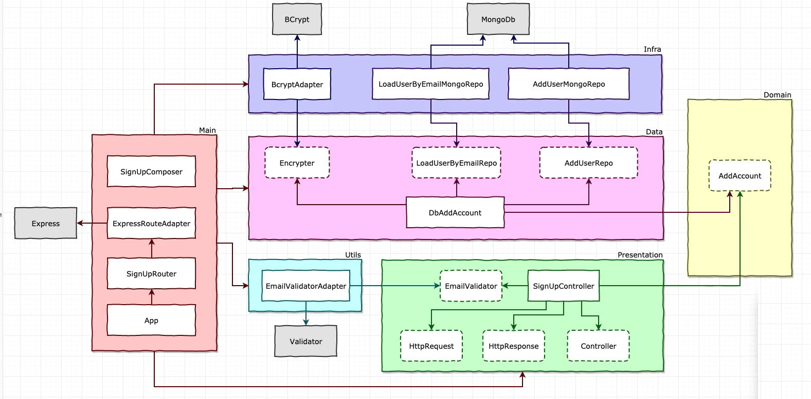

# <p align="center">Clean TS API</p>

<p align="center">
    
    
    
    
    
</p>

## 💬 About

This project was developed following Udemy's "[NodeJs, Typescript, TDD, DDD, Clean Architecture e SOLID](https://www.udemy.com/course/tdd-com-mango/)" class.


### 🏛 Architecture



## :computer: Technologies

- [Node.js](https://nodejs.org/en/)
- [TypeScript](https://www.typescriptlang.org/)
- [Husky](https://typicode.github.io/husky/#/)
- [Express](https://expressjs.com/)
- [Nodemailer](https://nodemailer.com/)
- [MongoDB](https://www.mongodb.com/)
- [Heroku](https://www.heroku.com/)
- [Jest](https://jestjs.io/)
- [Docker](https://www.docker.com/)
- [Docker Compose](https://docs.docker.com/compose/)

## :scroll: Requirements

- [Node.js](https://nodejs.org/en/)
- [Npm](https://www.npmjs.com/)
- [MongoDb](https://www.mongodb.com/)
- [Docker](https://www.docker.com/)
- [Docker Compose](https://docs.docker.com/compose/)

## :cd: Installation

```sh
git clone git@github.com:filipe1309/rm-clean-ts-api.git
```

```sh
cd rm-clean-ts-api
```

## :runner: Running

Up the database:
```sh
docker-compose run --rm --service-ports db
```

Up the api:
```sh
npm run start
```
<!-- # docker-compose up -->

> Access http://localhost:5050/api

### Endpoints

[Access here.](./api.http)

## :white_check_mark: Tests

```sh
npm run test
```
```sh
npn run test:verbose
```
```sh
npn run test:unit
```
```sh
npn run test:integration
```
```sh
npn run test:staged
```
```sh
npn run test:ci
```
```sh
npn run test:clear
```

<!-- 
## Contributing

Pull requests are welcome. For major changes, please open an issue first to discuss what you would like to change.

Please make sure to update tests as appropriate. -->

## License

[MIT](https://choosealicense.com/licenses/mit/)

## About Me

<p align="center">
    <a style="font-weight: bold" href="https://github.com/filipe1309/">
    
    </a>
</p>

---

<p align="center">
    Done with&nbsp;&nbsp;:heart:&nbsp;&nbsp;by <a style="font-weight: bold" href="https://github.com/filipe1309/">Filipe Leuch Bonfim</a> 🖖
</p>

---

> @ Generated with [ShubcoGen Template™](https://github.com/filipe1309/shubcogen-template) v0.3.11  
> ❓ [Docs](./.shub/README.md)
