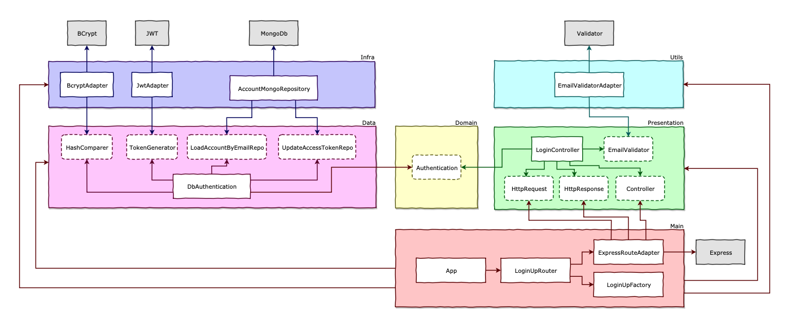

# <p align="center">Survey - Clean TS API</p>

[](https://circleci.com/gh/filipe1309/rm-clean-ts-api/tree/main)

<p align="center">
    
    
    
    
    
</p>

## 💬 About

This project was developed following Udemy's "[NodeJs, Typescript, TDD, DDD, Clean Architecture e SOLID](https://www.udemy.com/course/tdd-com-mango/)" class.


### 🏛 Architecture


#### 🔑 Login



> ## APIs built during training

1. [SignUp](./requirements/signup.md)
2. [Login](./requirements/login.md)
3. [Add survey](./requirements/add-survey.md)
4. [List surveys](./requirements/load-surveys.md)
5. [Answer survey](./requirements/save-survey-result.md)
6. [Survey result](./requirements/load-survey-result.md)

> ## Principles

* Single Responsibility Principle (SRP)
* Open Closed Principle (OCP)
* Liskov Substitution Principle (LSP)
* Interface Segregation Principle (ISP)
* Dependency Inversion Principle (DIP)
* Separation of Concerns (SOC)
* Don't Repeat Yourself (DRY)
* You Aren't Gonna Need It (YAGNI)
* Keep It Simple, Silly (KISS)
* Composition Over Inheritance
* Small Commits

> ## Design Patterns

* Factory
* Adapter
* Composite
* Decorator
* Proxy
* Dependency Injection
* Abstract Server
* Composition Root
* Builder
* Singleton

> ## Methodologies & Designs

* TDD
* Clean Architecture
* DDD
* Conventional Commits
* GitFlow
* Modular Design
* Dependency Diagrams
* Use Cases
* Continuous Integration
* Continuous Delivery
* Continuous Deployment


> ## Features - Node

* API Docs with Swagger
* API Rest with Express
* GraphQL with Apollo Server
* Log de Erro
* Security(Hashing, Encryption & Encoding)
* CORS
* Middlewares
* Access leves in routes (Admin, User & Anon)
* Heroku Deploy
* Static files

> ## Features - GraphQL

* Types
* Queries
* Mutations
* Resolvers
* Directives
* Scalars
* Plugins

> ## Features - Git

* Alias
* Custom Log
* Branch
* Reset
* Amend
* Tag
* Stash
* Rebase
* Merge

> ## Features do Typescript

* Advanced POO
* Interface
* TypeAlias
* Namespace
* Utility Types
* Paths Modularization
* Configs
* Build
* Deploy
* Breakpoints

> ## Features do GraphQL

* Resolvers
* Type Definitions
* Directives
* Scalars
* Plugins
* Error Handling

> ## Features - Tests

* Unit tests
* Integration tests (API Rest & GraphQL)
* Coverage
* Test Doubles
* Mocks
* Stubs
* Spies
* Fakes

> ## Features - MongoDb

* Connect e Reconnect
* Collections
* InsertOne e InserMany
* Find, FindOne e FindOneAndUpdate
* DeleteMany
* UpdateOne
* Aggregation (Match, Group, Unwind, Lookup, AddFields, Project, Sort)
* ObjectId
* Upsert e ReturnOriginal
* Push, Divide, Multiply, ArrayElemAt, Cond, Sum
* Filter, Map, Reduce, MergeObjects, ConcatArrays

## :computer: Technologies

- [Node.js](https://nodejs.org/en/)
- [TypeScript](https://www.typescriptlang.org/)
- [Husky](https://typicode.github.io/husky/#/)
- [Express](https://expressjs.com/)
- [Nodemailer](https://nodemailer.com/)
- [MongoDB](https://www.mongodb.com/)
- [Heroku](https://www.heroku.com/)
- [Jest](https://jestjs.io/)
- [Docker](https://www.docker.com/)
- [Docker Compose](https://docs.docker.com/compose/)
- [NPM](NPM)
- [Git](Git)
- [Travis CI](Travis_CI)
- [Swagger](Swagger)
- [Bcrypt](Bcrypt)
- [JsonWebToken](JsonWebToken)
- [Faker](Faker)
- [Coveralls](Coveralls)
- [Validator](Validator)
- [Express](Express)
- [Apollo Server Express](Apollo_Server_Express)
- [Graphql](Graphql)
- [Graphql ISO Date](Graphql_ISO_Date)
- [Graphql Scalars](Graphql_Scalars)
- [Graphql Tools](Graphql_Tools)
- [Supertest](Supertest)
- [Lint Staged](Lint_Staged)
- [Eslint](Eslint)
- [Standard Javascript Style](Standard_Javascript_Style)
- [Sucrase](Sucrase)
- [Nodemon](Nodemon)
- [Rimraf](Rimraf)
- [In-Memory MongoDb Server](In-Memory_MongoDb_Server)
- [MockDate](MockDate)
- [Module-Alias](Module-Alias)
- [Copyfiles](Copyfiles)
- [Npm Check](Npm_Check)
- [Bson ObjectId](Bson_ObjectId)
- [Apollo Server Integration Testing](Apollo_Server_Integration_Testing)

## :scroll: Requirements

- [Docker](https://www.docker.com/)
- [Docker Compose](https://docs.docker.com/compose/)

## :cd: Installation

```sh
git clone git@github.com:filipe1309/rm-clean-ts-api.git
```

```sh
cd rm-clean-ts-api
```

## :runner: Running

Up the container with tha API & DB:
```sh 
make up
```
> Stop with `make down`

> See [Makefile](./Makefile) for more information

> Access http://localhost:5050/api

> Access docs http://localhost:5050/api-docs

### Endpoints

[Access `api.http` here.](./api.http)

## :white_check_mark: Tests

```sh
make test
```
```sh
make test-verbose
```
```sh
make test-unit
```
```sh
make test-integration
```
```sh
make test-staged
```
```sh
make test-ci
```
```sh
make test-clear
```

<!-- 
## Contributing

Pull requests are welcome. For major changes, please open an issue first to discuss what you would like to change.

Please make sure to update tests as appropriate. -->

## License

[MIT](https://choosealicense.com/licenses/mit/)

## About Me

<p align="center">
    <a style="font-weight: bold" href="https://github.com/filipe1309/">
    
    </a>
</p>

---

<p align="center">
    Done with&nbsp;&nbsp;:heart:&nbsp;&nbsp;by <a style="font-weight: bold" href="https://github.com/filipe1309/">Filipe Leuch Bonfim</a> 🖖
</p>

---

> @ Generated with [ShubcoGen Template™](https://github.com/filipe1309/shubcogen-template) v0.3.11  
> ❓ [Docs](./.shub/README.md)
